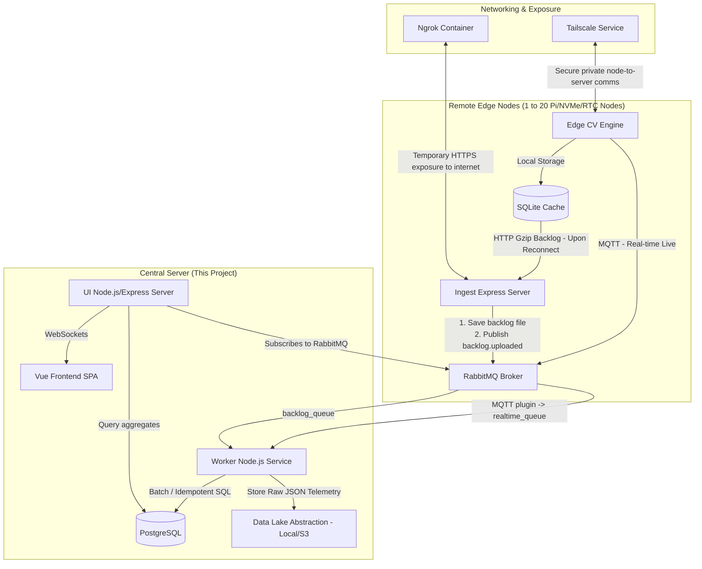

# Central Server: System Architecture & Specification Reference (`big_picture.md`)

This document outlines the end-to-end architecture, communication specs, database models, and deployment configurations for the **Central Server** of the **Edge Computer Vision Analytics System**.

---

## 1. System Overview

The system captures real-time edge computer vision analytics from multiple remote installations (Edge Nodes) and centralizes the data for dashboard reporting and data engineering analysis. 

### Architecture Diagram



---

## 2. Communication Protocols & Specs

### A. Authentication & Identification
Each request from an Edge Node must be authenticated.
* **HTTP Headers**:
  ```http
  Authorization: Bearer <JWT_API_KEY>
  X-Node-ID: <NODE_ID>
  ```
* **MQTT Auth**: Nodes connect to the RabbitMQ MQTT port using `username = NODE_ID` and `password = JWT_API_KEY`.

### B. Real-time Telemetry (MQTT)
MQTT messages are published to RabbitMQ (Port 8883 / 1883 in development) with QoS 1.

#### 1. Dwell Time Events
* **Topic**: `nodes/{node_id}/telemetry/dwell`
* **Trigger**: Triggered when a tracked object exits an engagement zone and its dwell duration exceeds a threshold.
* **Payload**:
  ```json
  {
    "event_id": "dw_1718042400_08f2",
    "node_id": "node_retail_01",
    "timestamp": 1718042400.125,
    "track_id": 412,
    "zone_id": 1,
    "dwell_time_sec": 14.5
  }
  ```

#### 2. Traffic Flow Coordinates (Trajectories)
* **Topic**: `nodes/{node_id}/telemetry/traffic`
* **Trigger**: Emitted periodically (batched every 5s) for objects in motion inside active zones.
* **Payload**:
  ```json
  {
    "event_id": "tf_1718042405_41a8",
    "node_id": "node_retail_01",
    "timestamp": 1718042405.000,
    "flow_records": [
      { "track_id": 412, "x": 320.5, "y": 240.2 },
      { "track_id": 415, "x": 115.1, "y": 405.8 }
    ]
  }
  ```

#### 3. System Health & Metrics
* **Topic**: `nodes/{node_id}/telemetry/metrics`
* **Trigger**: Emitted every 5 seconds.
* **Payload**:
  ```json
  {
    "event_id": "sys_1718042400_b6c4",
    "node_id": "node_retail_01",
    "timestamp": 1718042400.000,
    "metrics": {
      "cpu_load_percent": 42.5,
      "ram_usage_percent": 68.1,
      "vram_usage_mb": 128.0,
      "current_fps": 12.4,
      "live_people_count": 3,
      "zone_counts": [1, 2, 0]
    }
  }
  ```

### C. Backlog Database Uploads (HTTP/REST)
When a node recovers from an offline state (up to 2 months buffer), it uploads its sqlite database files.
* **Endpoint**: `POST /api/v1/nodes/upload-backlog`
* **Content-Type**: `application/gzip`
* **Workflow**:
  1. Ingest server receives and saves file to a local buffer folder (e.g. `/tmp/backlog_uploads/`).
  2. Ingest server publishes notification to RabbitMQ exchange `backlog_exchange` with routing key `backlog.uploaded`:
     ```json
     {
       "event": "backlog_uploaded",
       "node_id": "node_retail_01",
       "file_path": "/tmp/backlog_uploads/backlog_20260716104000.db.gz",
       "timestamp": 1718042422.0
     }
     ```
  3. Respond immediately with `201 Created` to release the node.
  4. Downstream worker processes the queue, decompresses the sqlite database, runs batch SQL inserts idempotently using composite keys, and then deletes the files.

---

## 3. Database Schema Blueprint (Prisma ORM)

Below is the blueprint schema designed to handle central analytics storage. Unique constraints are configured as composite indexes to prevent duplicates from backlog thundering herds.

```prisma
datasource db {
  provider = "postgresql"
  url      = env("DATABASE_URL")
}

generator client {
  provider = "prisma-client-js"
}

// Represents registered edge nodes
model Node {
  id            String          @id
  name          String
  location      String?
  jwtApiKeyHash String
  createdAt     DateTime        @default(now())
  updatedAt     DateTime        @updatedAt
  dwellLogs     DwellTimeLog[]
  trafficLogs   TrafficFlowLog[]
  sysMetrics    SystemMetric[]
}

// 1. Dwell Time Analytics
model DwellTimeLog {
  id           String   @id @default(uuid())
  eventId      String   // Original event_id generated on the edge (e.g. dw_1718042400_08f2)
  nodeId       String
  timestamp    DateTime
  trackId      Int
  zoneId       Int
  dwellTimeSec Float
  createdAt    DateTime @default(now())

  node         Node     @relation(fields: [nodeId], references: [id], onDelete: Cascade)

  // Composite key constraint prevents duplicate entries during backlog thundering herd uploads
  @@unique([nodeId, timestamp, trackId])
  @@index([timestamp])
  @@index([nodeId])
}

// 2. Traffic Flow / Path Coordinates
model TrafficFlowLog {
  id        String   @id @default(uuid())
  eventId   String   // Original event_id generated on the edge
  nodeId    String
  timestamp DateTime
  trackId   Int
  x         Float
  y         Float
  createdAt DateTime @default(now())

  node      Node     @relation(fields: [nodeId], references: [id], onDelete: Cascade)

  // Composite key ensures coordinates for a specific track at a specific timestamp are unique per node
  @@unique([nodeId, timestamp, trackId, x, y])
  @@index([timestamp])
  @@index([nodeId])
}

// 3. System Performance & Health Metrics
model SystemMetric {
  id               String   @id @default(uuid())
  eventId          String
  nodeId           String
  timestamp        DateTime
  cpuLoadPercent   Float
  ramUsagePercent  Float
  vramUsageMb      Float
  currentFps       Float
  livePeopleCount  Int
  zoneCounts       Int[]    // Array representing occupancy counts per zone
  createdAt        DateTime @default(now())

  node             Node     @relation(fields: [nodeId], references: [id], onDelete: Cascade)

  @@unique([nodeId, timestamp])
  @@index([timestamp])
  @@index([nodeId])
}
```

---

## 4. Storage Abstraction (Data Lake)

To decouple the system from the underlying raw storage mechanism and make it easy to migrate from the local disk to a cloud object store (like AWS S3 or MinIO) in the future, we define a core abstraction:

```typescript
export interface DataLakeStorage {
  /**
   * Saves a raw telemetry JSON payload or file to the data lake.
   * @param path The target folder/key in the data lake (e.g. 'raw-telemetry/node-01/2026-07-16.json')
   * @param content The text/buffer content to save.
   */
  write(path: string, content: string | Buffer): Promise<void>;
  
  /**
   * Retrieves a file/object from the data lake.
   * @param path The folder/key to fetch.
   */
  read(path: string): Promise<Buffer>;
}
```

### Initial Implementation (Local File Driver)
In the initial development phase, the `LocalDiskStorage` class will implement this interface by writing files to a configured local directory:
* Root folder defined in environment variable: `DATA_LAKE_LOCAL_PATH` (e.g. `./app/data_lake_raw/`).

### Future Transition (S3 Driver)
When moving to AWS S3, a new `S3StorageDriver` can be introduced to implement the interface using the AWS SDK, with configuration keys `AWS_S3_BUCKET`, `AWS_ACCESS_KEY_ID`, and `AWS_SECRET_ACCESS_KEY` loaded into `.env` without modifying worker service logic.

---

## 5. Development Networking Setup

1. **Tailscale Private Link**:
   - Containers run on a private tailnet. Remote edge nodes connect to the gateway server via the Tailscale daemon running locally or as a sidecar container, securing data without exposing public ports.
2. **Ngrok Public Tunnel**:
   - A sidecar container in `docker-compose.yml` connects to the `ingest-server` port, creating a public dynamic HTTPS endpoint (`https://xxxx.ngrok-free.app`) to simplify remote edge node communication and testing from external devices during sandbox development.
